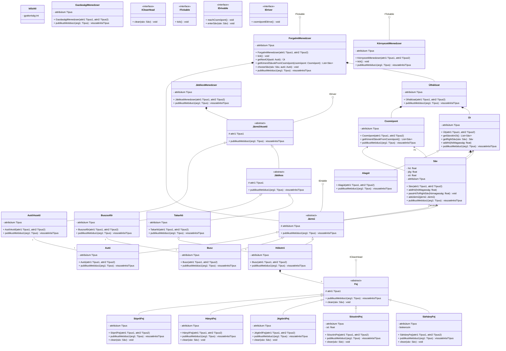

# Hókotró - Class Diagram

```mermaid
classDiagram


%% Jármű Hierarchia

class Jármű {
    <<abstract>>
    # attribútum Típus

    + publikusMetódus1(arg1: Típus) visszatérésiTípus
}

class Autó {
    - attribútum Típus

    + Autó(attri1 Típus1, attri2 Típus2)
    + publikusMetódus1(arg1: Típus) visszatérésiTípus
}

class Busz {
    - attribútum Típus

    + Busz(attri1 Típus1, attri2 Típus2)
    + publikusMetódus1(arg1: Típus) visszatérésiTípus
}

class Hókotró {
    - attribútum Típus

    + Busz(attri1 Típus1, attri2 Típus2)
    + publikusMetódus1(arg1: Típus) visszatérésiTípus
}


%% Jármű Vezető Hierarchia

class JárműVezető {
    <<abstract>>
    # attri1 Típus1

    + publikusMetódus1(arg1: Típus) visszatérésiTípus
}

class AutóVezető {
    - attribútum Típus

    + AutóVeztő(attri1 Típus1, attri2 Típus2)
    + publikusMetódus1(arg1: Típus) visszatérésiTípus
}

class Játékos {
    <<abstract>>
    # attri1 Típus1

    + publikusMetódus1(arg1: Típus) visszatérésiTípus
}

class Buszsofőr {
    - attribútum Típus

    + Buszsofőr(attri1 Típus1, attri2 Típus2)
    + publikusMetódus1(arg1: Típus) visszatérésiTípus
}

class Takarító {
    - attribútum Típus

    + Takarító(attri1 Típus1, attri2 Típus2)
    + publikusMetódus1(arg1: Típus) visszatérésiTípus
}


%% Fej Hierarchia

class Fej {
    <<abstract>>
    # attri1 Típus1

    + publikusMetódus1(arg1: Típus) visszatérésiTípus
    + clean(sáv: Sáv) void
}

class SöprőFej {
    - attribútum Típus

    + SöprőFej(attri1 Típus1, attri2 Típus2)
    + publikusMetódus1(arg1: Típus) visszatérésiTípus
    + clean(sáv: Sáv) void
}

class HányóFej {
    - attribútum Típus

    + HányóFej(attri1 Típus1, attri2 Típus2)
    + publikusMetódus1(arg1: Típus) visszatérésiTípus
    + clean(sáv: Sáv) void
}

class JégtörőFej {
    - attribútum Típus

    + JégtörőFej(attri1 Típus1, attri2 Típus2)
    + publikusMetódus1(arg1: Típus) visszatérésiTípus
    + clean(sáv: Sáv) void
}

class SószóróFej {
    - attribútum Típus
    - só: float

    + SószóróFej(attri1 Típus1, attri2 Típus2)
    + publikusMetódus1(arg1: Típus) visszatérésiTípus
    + clean(sáv: Sáv) void
}

class SárkányFej {
    - attribútum Típus
    - biokerozin

    + SárkányFej(attri1 Típus1, attri2 Típus2)
    + publikusMetódus1(arg1: Típus) visszatérésiTípus
    + clean(sáv: Sáv) void
}


%% Úthálózat Hierarchia

class Úthálózat {
    - attribútum Típus

    + Úthálózat(attri1 Típus1, attri2 Típus2)
    + publikusMetódus1(arg1: Típus) visszatérésiTípus
}

class Csomópont {
    - attribútum Típus

    + Csomópont(attri1 Típus1, attri2 Típus2)
    + getKimenőSávokFromCsomópont() List&lt;Sáv&gt;
    + publikusMetódus1(arg1: Típus) visszatérésiTípus
}

class Út {
    - attribútum Típus

    + Út(attri1 Típus1, attri2 Típus2)
    + getSávokInÚt() List&lt;Sáv&gt;
    + getRightSáv(sáv: Sáv) Sáv
    + addHó(hóMagasság: float)
    + publikusMetódus1(arg1: Típus) visszatérésiTípus
}

class Alagút {
    + Alagút(attri1 Típus1, attri2 Típus2)
    + publikusMetódus1(arg1: Típus) visszatérésiTípus
}

class Sáv {
    - hó: float
    - jég: float
    - só: float
    - attribútum Típus

    + Sáv(attri1 Típus1, attri2 Típus2)
    + addHó(hóMagasság: float)
    + passHóToRightSáv(hómagasság: float) void
    + addJármű(jármű: Jármű)
    + publikusMetódus1(arg1: Típus) visszatérésiTípus
}

%% Menedzserek

class Időzítő {
    - gyakoriság int
}

class ForgalmiMenedzser {
    - attribútum Típus

    + ForgalmiMenedzser(attri1 Típus1, attri2 Típus2)
    + tick() void
    + getNextÚt(autó: Autó) Út
    + getKimenőSávokFromCsomópont(csomópont: Csomópont) List&lt;Sáv&gt;
    + chooseSáv(sáv: Sáv, autó: Autó) void
    + publikusMetódus1(arg1: Típus) visszatérésiTípus
}

class KörnyezetiMenedzser {
    - attribútum Típus

    + KörnyezetiMenedzser(attri1 Típus1, attri2 Típus2)
    + tick() void
    + publikusMetódus1(arg1: Típus) visszatérésiTípus
}

class GazdaságiMenedzser {
    - attribútum Típus

    + GazdaságiMenedzser(attri1 Típus1, attri2 Típus2)
    + publikusMetódus1(arg1: Típus) visszatérésiTípus
}

class JátékosMenedzser {
    - attribútum Típus

    + JátékosMenedzser(attri1 Típus1, attri2 Típus2)
    + publikusMetódus1(arg1: Típus) visszatérésiTípus
}


%% Interfészek

class ICleanHead {
    <<interface>>

    + clean(sáv: Sáv) void
}

class ITickable {
    <<interface>>

    + tick() void
}

class IDrivable {
    <<interface>>
    + reachCsomópont() void
    + enterSáv(sáv: Sáv) void
}

class IDriver {
    <<interface>>
    + csomópontElérve() void
}


%% Leszármazás/Általánosítás kapcsolatok

Jármű <|-- Autó
Jármű <|-- Busz
Jármű <|-- Hókotró

JárműVezető <|-- AutóVezető
JárműVezető <|-- Játékos
Játékos <|-- Buszsofőr
Játékos <|-- Takarító

Fej <|-- SöprőFej
Fej <|-- HányóFej
Fej <|-- JégtörőFej
Fej <|-- SószóróFej
Fej <|-- SárkányFej

Út <|-- Alagút


%% Kompozíció kapcsolatok

Hókotró *-- "1.." Fej

Úthálózat *-- Csomópont
Úthálózat *-- Út

Út *-- Sáv

ForgalmiMenedzser *-- Jármű
ForgalmiMenedzser *-- Úthálózat

JátékosMenedzser *-- JárműVezető


%% Aggregáció kapcsolatok

Takarító o-- "1.." Hókotró

Sáv o-- Jármű


%% Asszociáció kapcsolatok

AutóVezető "1" -- "1" Autó
Buszsofőr "1" -- "1" Busz

Csomópont "kezdő" <-- Sáv
Csomópont "vég" <-- Sáv

Út "szülő" <-- Sáv

Sáv "aktuálisSáv" <-- Jármű


%% Lollipop Interfészek

ITickable ()-- ForgalmiMenedzser
ITickable ()-- KörnyezetiMenedzser

ICleanHead ()-- Fej

IDriable ()-- Jármű
IDriver ()-- JárműVezető
```
