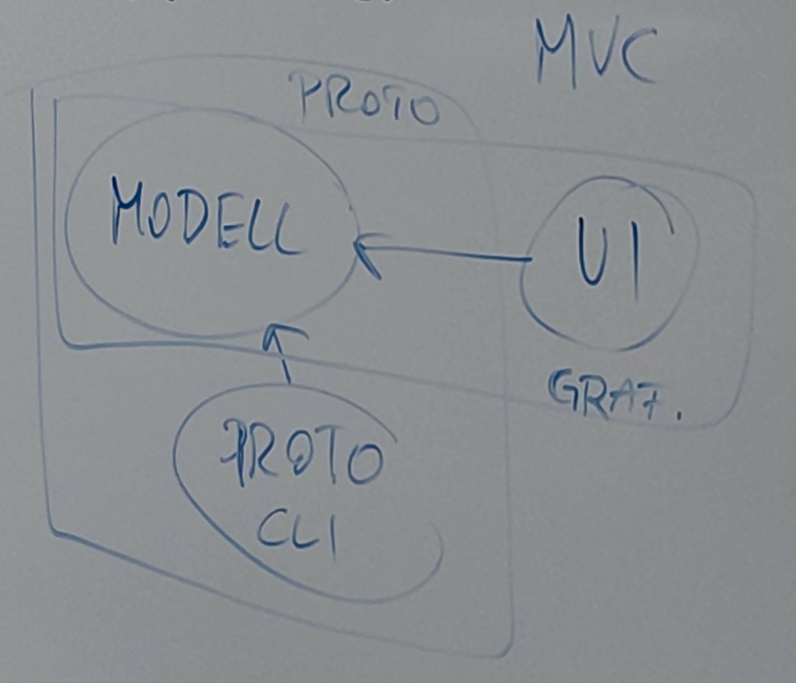

Szabó András
andras.szabo@iit.bme.hu
szaboandras.dev

Hasznos olvasnivaló: Design patterns, Refactoring (Code mmells, Shotgun sergery)
https://refactoring.guru/

# Projlab - Hókotró

## Proto
Modell + CLI

## Szkeleton
Modell + CLI + UI
MVC!!!

Modell az csak modell legyen pl. csak adatot tartalmazzon, szóval ne függjön, hogy 2D-ben vagy 3D-ben legyen végül megoldva

Wired, beégetett értékek az elvárt kimenetnél:skull:
Ne print-elős legyen!!!

Leírás, hogy mi hogyan értelmeztük a feladatot!!! (viszont ne mondjon ellent az eredeti )
De ne bonyolítsuk túl, mert lesz mivel szívni :c

Ne rakjunk bele olyan dolgokat, amik nem szerepelnek a leírásban pl. scoreboard, főlap stb.

Ne legyen benne Java-specifikus dolog!

ABC sorrend a szótárban! Nyelvtani szabályok!!! (olvassuk el)

Először elemi funkciókat csináljuk meg, amiket a játékos csinálni tud!

Ha betölthetőt akarunk (amit nem szeretnénk), akkor kéne kilépés usecase (de most nem kell!!!)

Pálya felépítése is usecase!!!

Időzített események (nézzünk utána, hogy miket/hogyan szabad!, elvileg ez is usecase-nek számít)

| Főnév         | Ige         | !főnév && !ige && hasznosnak tűnik |
| :---          |    :----:   |          ---:                      |
| Hókotró       | Havazik     | vékony hó                          |
| Város (pálya) | Közlekedik  | vastag hó                          |
| Havazás       | letapos     | járhatatlan                        |
| Autó          | kocc        | legrövidebb út                     |
| Hó            | lefagy      |                                    |
| Jégpáncél     |             |                                    |
| Sáv           |             |                                    |
| Lakás         |             |                                    |
| Munkahely     |             |                                    |

stb...

Fő take-away: NE LEGYETEK OLYANOK, MINT ZOLI BÁCSI!